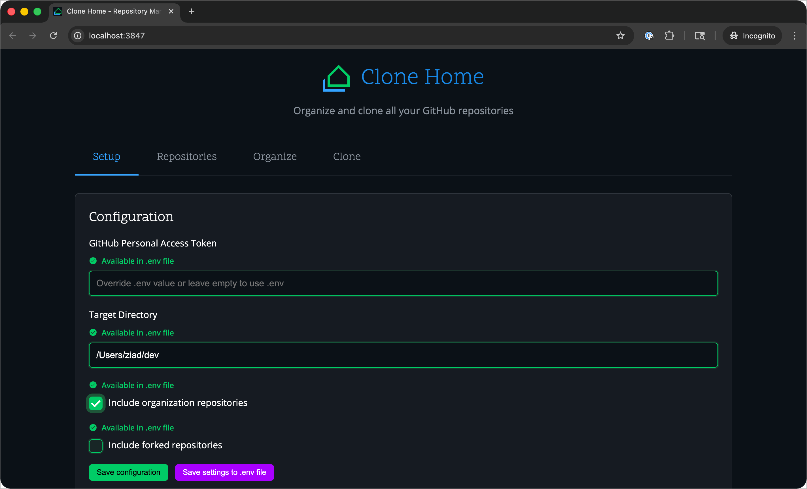

# Clone Home 🏠

A powerful GitHub repository management tool with both web interface and CLI. Clone, organize, and manage all your GitHub repositories with an intuitive drag-and-drop web interface or command-line tools. Perfect for quickly setting up a new development workstation with all your repositories.

## ✨ Key Features

- **🌐 Web Interface**: Drag-and-drop organization with visual folder management
- **🖥️ Command Line**: Powerful CLI with filtering, dry-run, and automation
- **🤖 Auto-Organization**: One-click organization by owner, language, or year
- **💾 Dual Configuration Export**: Save both `.env` files and `.clonehome` organization files from the web interface
- **🔍 Smart Filtering**: Advanced search and filtering capabilities
- **⚡ One-Click Cloning**: Clone all repositories with a single command
- **🛡️ Safe Operations**: Preview mode and safety checks prevent accidents
- **🔄 Real-time Updates**: Automatic .env file monitoring without server restart
- **⚡ Performance Optimized**: Memory-efficient with optimized operations

## 📸 Screenshot



## 🚀 Quick Start

### Web Interface (Recommended)

```bash
npm install
npm start web
```

Open `http://localhost:3847` and follow the Setup → Organize → Clone workflow.

### Command Line

```bash
npm install
npm start setup  # Configure GitHub token and preferences
npm start clone  # Clone all repositories
```

## Installation

**Prerequisites**: Node.js 18.0.0+, Git, GitHub Personal Access Token

```bash
npm install
npm link  # Optional: make CLI globally available
```

## Setup

1. **Create GitHub Personal Access Token** with `repo` and `read:org` scopes
2. **Configure Clone Home**: `npm start setup`

Configuration is stored in `~/.clone-home/config.json`

## 📚 Documentation

- **[Web Interface Guide](docs/web-interface.md)** - Complete guide to using the drag-and-drop web interface
- **[Command Line Guide](docs/cli-guide.md)** - Detailed CLI usage, commands, and configs
- **[Performance Analysis](docs/performance-analysis.md)** - Memory usage and optimization details
- **[Troubleshooting Guide](docs/troubleshooting.md)** - Common issues and solutions
- **[Development Guide](docs/development.md)** - Development setup and contribution guidelines
- **[Usage Examples & Configuration](configs/README.md)** - Comprehensive examples, workflows, and configuration files

## 🌐 Web Interface

Start the web interface: `npm start web` → Open `http://localhost:3847`

**Features**: Setup → Browse Repositories → Organize with Drag & Drop → **Export Both .env & .clonehome Files** → Clone

**Key Advantage**: The web interface can export **both** configuration file types:

- **`.env` files** with your GitHub token and settings
- **`.clonehome` files** with your repository organization structure

Perfect for setting up new development machines with complete configuration!

## �️ Command Line

Basic commands:

```bash
npm start setup   # Configure GitHub token and preferences
npm start list    # List all repositories
npm start clone   # Clone all repositories
npm start status  # Check local repository status
```

**Advanced**: Use `--filter`, `--dry-run`, and `--force` options for precise control.

## Configuration

Configuration is stored in `~/.clone-home/config.json`. **The web interface provides dual export capabilities:**

- **`.env` files**: Export your GitHub token and settings for easy project setup
- **`.clonehome` files**: Save and share your repository organization structure

This allows you to quickly set up new development environments with both authentication and folder organization in place.

## Security

- GitHub tokens are stored locally in the project's `.env` file
- Tokens are never logged or transmitted anywhere except to GitHub's API
- Use tokens with minimal required permissions

## License

MIT License - see LICENSE file for details.

## Contributing

1. Fork the repository
2. Create a feature branch
3. Make your changes
4. Add tests if applicable
5. Submit a pull request
